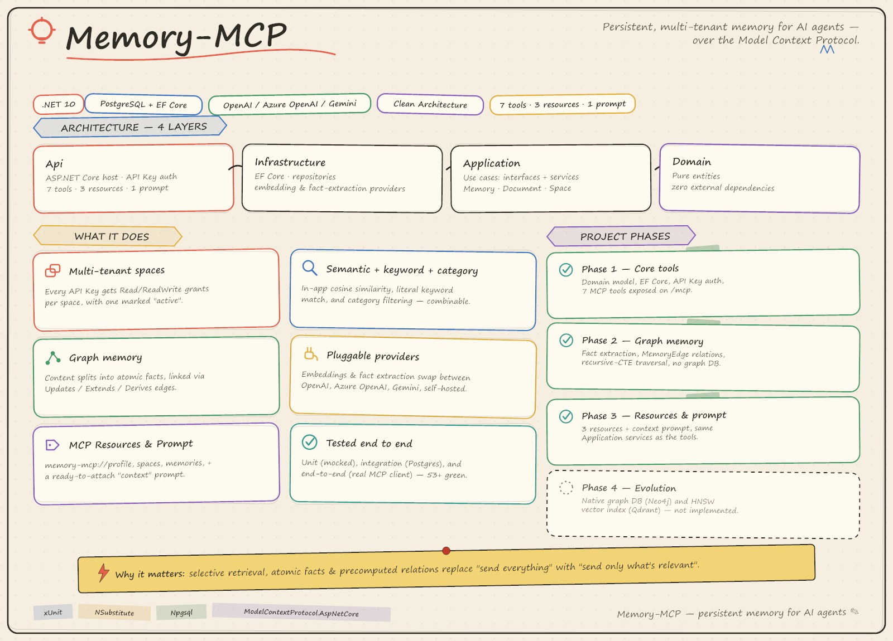

# Memory-MCP



Remote MCP (Model Context Protocol) server for storing, retrieving, and semantically searching
"memories" on behalf of AI agents, organized into multi-tenant **spaces** and protected by API Key.

Full functional specification: [CLAUDE.md](CLAUDE.md).

## Table of contents

- [Architecture](#architecture)
- [Technology](#technology)
- [Data model](#data-model)
- [Available MCP tools](#available-mcp-tools)
- [Available MCP resources and prompts](#available-mcp-resources-and-prompts)
- [Project phases](#project-phases)
- [Setup and startup](#setup-and-startup)
- [Tests](#tests)
- [Docker](#docker)

## Architecture

4-layer Clean Architecture, with dependencies flowing in a single direction (`Api` → `Infrastructure`/`Application` → `Domain`):

```
Memory-MCP/
├── src/
│   ├── MemoryMcp.Domain/          # Pure entities (Space, ApiKey, ApiKeySpaceGrant, Document, Memory)
│   │                              # No dependency on EF/HTTP/external libraries.
│   ├── MemoryMcp.Application/     # Use cases: interfaces (IMemoryService, IDocumentService,
│   │                              # ISpaceService, IEmbeddingProvider, repositories, ICurrentAccessContext)
│   │                              # + application service implementations + DTOs.
│   ├── MemoryMcp.Infrastructure/   # EF Core (MemoryDbContext, migrations, repositories), embedding
│   │                              # provider (OpenAI/Azure OpenAI/Gemini) and fact extractor for graph memory.
│   └── MemoryMcp.Api/             # ASP.NET Core host: MCP hosting, API Key authentication,
│                                  # the 7 MCP tools (thin adapters with no business logic).
└── tests/
    ├── MemoryMcp.Application.Tests/    # Unit tests for the application services (mock/NSubstitute)
    ├── MemoryMcp.Infrastructure.Tests/ # Integration tests for the repositories against a real Postgres
    └── MemoryMcp.Api.Tests/            # End-to-end tests for the 7 tools via an MCP client + WebApplicationFactory
```

**Why Clean Architecture and not Vertical Slice**: all tools share the same data model
(Space/ApiKey/Memory/Document) and the same per-space authorization rules; isolating EF persistence
and the embedding provider behind interfaces in `Application` allows the project to be extended (resources,
prompts, MCP Apps widgets — Phase 3) with at most small, additive `Application` service methods and no
changes to `Domain`.

Every class in `Api/Tools` is a **thin adapter**: it resolves the access context (`ICurrentAccessContext`),
calls the application service, and formats the output — no business logic in the Api layer.

### Authentication and multi-tenancy

- Every **API Key** is associated with one or more **spaces**, with an access level (`Read` or `ReadWrite`) per
  space, and one space marked as "active" (`IsDefault`).
- `ApiKeyAuthenticationHandler` (`src/MemoryMcp.Api/Auth`) reads the key from the `X-Api-Key` header (or
  `Authorization: Bearer <key>`), validates it against the database (SHA-256 hash, never the plaintext key), and
  populates `CurrentAccessContext`, a scoped service injected into the application services.
- The tools' `containerTag` parameter corresponds to the `spaces.key` column; if omitted, the current
  key's "active" space is used.
- Authorization/space-not-found errors are translated into MCP tool results with `isError=true`
  (never unhandled exceptions or 500s).

### Semantic search

`IEmbeddingProvider` is pluggable (OpenAI, Azure OpenAI, or Gemini — the same OpenAI SDK
`EmbeddingClient` under all three, pointed at a different base URL for Gemini, since its API is
OpenAI-compatible). Embeddings are stored as a native Postgres `real[]` column (via Npgsql), and cosine
similarity is computed **in-app** in `MemoryRepository.SearchAsync`. The requested embedding width
(`Embeddings:Dimensions`, forwarded as the OpenAI "dimensions" parameter) is configurable — it defaults
to `1536` (OpenAI's `text-embedding-3-small`); when using Gemini's `gemini-embedding-001` prefer its
native `3072` rather than truncating, since that model needs the result manually re-normalized for
non-native widths. All memories in a space must share the same width, since there's no `pgvector`
index to bridge dimension mismatches.

Besides semantic search, `search_memory` also supports literal keyword search
(`keyword`, case-insensitive match via `ILIKE` in `MemoryRepository.SearchByKeywordAsync`, without generating
an embedding) and filtering/listing by category (`category`, an optional column on `memories`, assignable in
`add_memory`). The three criteria can be combined: `query`/`keyword` can be further restricted by
`category`; if only `category` is given, `MemoryRepository.ListByCategoryAsync` lists the memories in that
category ordered by creation date. At least one of `query`, `keyword`, and `category` must be provided.

> Note: the original specification called for PostgreSQL + the `pgvector` extension with an HNSW index. In this
> environment Docker Desktop is blocked by company policy and the available local Postgres does not have
> `pgvector` installed (nor can it be installed without local admin permissions), so the
> search was implemented without the extension. It works correctly but doesn't scale as well as a native
> vector index on very large volumes — if `pgvector` becomes available in the future, migrating to
> an HNSW index requires revisiting `MemoryConfiguration` and `MemoryRepository.SearchAsync`.

### Graph memory

Saved content isn't stored verbatim as a single memory: `MemoryService.SaveAsync` first asks
`IFactExtractor` to split it into atomic facts and classify each fact's relation — `Updates`,
`Extends`, or `Derives` — to a handful of similar existing memories (fetched the same way
`ForgetAsync` finds candidates, via `IMemoryRepository.SearchAsync`). Each fact becomes its own
`Memory`, and each relation becomes a `MemoryEdge` row; an `Updates` relation also calls the existing
`Memory.Forget(supersededBy:)`, so `SupersededBy`/`IsActive` stay in sync with the edge that
generalizes them. `LlmFactExtractor` asks its chat model for this via JSON Schema structured output
(strict mode) rather than parsing free text, and relations pointing at memory ids outside the supplied
candidates are dropped defensively (a hallucinated id would otherwise violate the edge's foreign key).

There's no dedicated graph database in this environment either (same constraint as above) — traversal
(`MemoryEdgeRepository.GetRelatedAsync`) is a `WITH RECURSIVE` CTE over the plain `memory_edges`
table, parameterized through EF Core's `Database.SqlQuery<T>`, bounded by a hop count and a
visited-node path array to guarantee termination on cycles. `search_memory` attaches each top match's
related memories (text + relation type + hop count) via `MemoryGraphService`, additive to the existing
`MemorySearchResultDto` shape.

If `Extraction:ApiKey` is left unconfigured, `IFactExtractor` throws `ExtractorNotConfiguredException`
and `add_memory` transparently falls back to saving the whole content as a single memory with zero
edges — exactly Phase 1's behavior, so nothing breaks for callers who never configure extraction.
`IFactExtractor` is pluggable the same way as `IEmbeddingProvider` (OpenAI, Azure OpenAI, Gemini, or
any other OpenAI-compatible chat endpoint such as a self-hosted Ollama/vLLM/LM Studio model) by
configuration alone.

## Technology

| Layer | Technology |
| --- | --- |
| Runtime | .NET 10 (pinned in [global.json](global.json)) |
| MCP Server | `ModelContextProtocol` / `ModelContextProtocol.AspNetCore` 2.1.0 |
| Web host | ASP.NET Core Minimal API |
| Persistence | PostgreSQL + EF Core 10 (`Npgsql.EntityFrameworkCore.PostgreSQL`) |
| Embedding | `OpenAI` / `Azure.AI.OpenAI` (same `EmbeddingClient`, selected via configuration; also backs Gemini's OpenAI-compatible endpoint) |
| Fact extraction | Same `OpenAI` SDK's `ChatClient`, JSON Schema structured output (OpenAI / Azure OpenAI / Gemini / self-hosted OpenAI-compatible) |
| Authentication | Custom `AuthenticationHandler<T>` scheme based on API Key (SHA-256 hash) |
| Tests | xUnit, NSubstitute, AwesomeAssertions (MIT fork of FluentAssertions), `Microsoft.AspNetCore.Mvc.Testing` |
| Container | Multi-stage Dockerfile + docker-compose (for environments where Docker is available) |

## Data model

| Table | Description |
| --- | --- |
| `spaces` | Logical space (`key` unique = `containerTag`, `name`, `description`) |
| `api_keys` | API key (only the hash is stored, never the plaintext value) |
| `api_key_space_grants` | `Read`/`ReadWrite` permission of an API Key on a space + "active space" flag |
| `documents` | Source document (title, type, status, summary, raw content) |
| `memories` | Extracted memory (text, optional category, `real[]` embedding, version, `is_active` for soft-delete/"forget") |
| `memory_edges` | Typed, directed graph edge between two memories (`Updates`/`Extends`/`Derives`), scoped to a space |

## Available MCP tools

All 7 tools required by the specification are implemented in `src/MemoryMcp.Api/Tools`. `search_memory`
and `add_memory` are enriched by graph memory (related memories on search results, multi-fact
extraction on save) without any change to their tool contract — no new tool was added for this:

| Tool | File | Access required | Description |
| --- | --- | --- | --- |
| `search_memory` | `MemoryTools.cs` | Read | Searches a space's memories by semantic similarity (`query`), literal keyword (`keyword`), and/or category (`category`), with optional profile; top matches include `relatedMemories` from the graph |
| `add_memory` | `MemoryTools.cs` | ReadWrite | Saves (`action=save`, with optional `category`) or removes (`action=forget`) a memory; saving extracts atomic facts and links them to related existing memories as graph edges |
| `listDocuments` | `DocumentTools.cs` | Read | Paginated list of a space's source documents |
| `getDocument` | `DocumentTools.cs` | Read | Metadata and content of a document |
| `listMemories` | `MemoryTools.cs` | Read | Paginated list of extracted memories |
| `listSpaces` | `AccessTools.cs` | — | Spaces accessible with the current API Key, with counts |
| `whoAmI` | `AccessTools.cs` | — | Current identity, accessible spaces, active space |

## Available MCP resources and prompts

For clients that support them (Phase 3, see below) — implemented in `src/MemoryMcp.Api/Resources` and
`src/MemoryMcp.Api/Prompts`, both thin adapters over the same `Application` services the tools use:

| Kind | URI / Name | File | Description |
| --- | --- | --- | --- |
| Resource | `memory-mcp://profile` | `MemoryResources.cs` | Recent-active-memories profile context for the active space (the same set `search_memory`'s `includeProfile` attaches) |
| Resource | `memory-mcp://spaces` | `AccessResources.cs` | The same compact space list as `listSpaces`, with the active space marked |
| Resource | `memory-mcp://memories` | `MemoryResources.cs` | First page of the active space's memories (any status), same shape as `listMemories` |
| Prompt | `context` | `ContextPrompt.cs` | A ready-to-attach text message: the active space's profile, plus up to 3 other spaces ranked by their most recent memory |

All three resources are fixed (non-templated) URIs scoped to the API key's active space; none take
arguments. `IMemoryService.GetProfileAsync` is the one small additive `Application` method this phase
introduced — it's the profile-fetch logic already used by `search_memory`, extracted so it can be called
on its own instead of only alongside a search.

## Project phases

### Phase 1 — Completed

- [x] Domain entities and the relational data model (Space, ApiKey, ApiKeySpaceGrant, Document, Memory)
- [x] EF Core persistence + initial migration
- [x] API Key authentication with per-space permissions
- [x] Pluggable `IEmbeddingProvider` (OpenAI / Azure OpenAI)
- [x] The 7 core MCP tools, exposed via `ModelContextProtocol.AspNetCore` on the `/mcp` HTTP endpoint
- [x] Test suite (unit, integration, end-to-end)

### Phase 2 — Graph memory — Completed

See [docs/graph-memory-plan.md](docs/graph-memory-plan.md) for the full design.

- [x] `MemoryEdge`/`RelationType` domain model, generalizing the existing `SupersededBy`/`IsActive`/`Version` fields
- [x] Pluggable `IFactExtractor` (OpenAI / Azure OpenAI / Gemini / self-hosted OpenAI-compatible), with a
      strictly-additive fallback to Phase 1's single-memory save when unconfigured
- [x] `memory_edges` table + `WITH RECURSIVE` CTE traversal (`MemoryEdgeRepository`, no graph DB extension)
- [x] `search_memory` enriched with `relatedMemories`; `add_memory` extracts and links multiple facts per save
- [x] `Embeddings:Dimensions` made configurable (Gemini's native embedding width differs from OpenAI's)
- [x] Test suite extended (unit, integration, end-to-end)

### Phase 3 — Resources and prompt — Completed (widgets not implemented)

- [x] MCP Resources: `memory-mcp://profile`, `memory-mcp://spaces`, `memory-mcp://memories`
- [x] MCP Prompt: `context`
- [x] Test suite extended (end-to-end, via the MCP client's resource/prompt calls)
- [ ] Interactive MCP Apps widgets: `select-space`, `guided-save`, `upload-file`, `memory-graph`
      (require the `ModelContextProtocol.Extensions.Apps` package and iframe-based UI — the `memory-graph`
      widget would visualize the `memory_edges` table added in Phase 2; left for a future phase, to avoid
      blocking further extensibility)

### Phase 4 — Not implemented (evolution)
- [ ] Review project for introducing a real graphDB (Neo4j)
- [ ] Reintroducing `Qdrant` with a native HNSW index as the vector DB

The remaining MCP Apps widgets would be added as new classes in the `Api` project, reusing the
existing `Application` services, once the `ModelContextProtocol.Extensions.Apps` package and an
iframe-based UI are in scope.

## Setup and startup

### Prerequisites

- [.NET SDK 10](https://dotnet.microsoft.com/download) (version pinned in [global.json](global.json))
- A reachable PostgreSQL instance (local or remote). **The `pgvector` extension is not required.**
- (Optional) an OpenAI, Azure OpenAI, or Gemini API Key, needed only for the `add_memory` and `search_memory` tools
- (Optional) a second API Key (OpenAI / Azure OpenAI / Gemini / self-hosted) for fact extraction —
  without it, `add_memory` still works but saves whole content as a single memory with no graph edges

### 1. Configure the connection string

Create/update `src/MemoryMcp.Api/appsettings.Development.json` (file **not versioned**, see
[.gitignore](.gitignore)) with your Postgres connection string:

```json
{
  "ConnectionStrings": {
    "Default": "Host=localhost;Port=5432;Username=<user>;Password=<password>;Database=<database>"
  }
}
```

Alternatively, you can set the `ConnectionStrings__Default` environment variable without touching the
configuration files.

### 2. Apply migrations

```bash
dotnet tool restore # if you don't already have dotnet-ef installed: dotnet tool install --global dotnet-ef
dotnet ef database update --project src/MemoryMcp.Infrastructure --startup-project src/MemoryMcp.Api
```

> To wipe the database and start over from a clean schema (e.g. after accumulating test/throwaway
> spaces), run [scripts/reset-db.ps1](scripts/reset-db.ps1) — **destructive**, it drops and recreates
> the database pointed at by your current connection string, then re-applies all migrations and
> optionally reseeds a fresh `default` space + API key:
> ```powershell
> ./scripts/reset-db.ps1
> ```

### 3. (Optional) Configure the embedding provider

To use `add_memory`/`search_memory`, in `appsettings.Development.json`:

```json
{
  "Embeddings": {
    "Provider": "OpenAI",
    "ApiKey": "sk-...",
    "Model": "text-embedding-3-small"
  }
}
```

For Azure OpenAI: `"Provider": "AzureOpenAI"`, `"Endpoint": "https://<resource>.openai.azure.com"`,
`"Model"` = deployment name. For Gemini (its API is OpenAI-compatible):

```json
{
  "Embeddings": {
    "Provider": "Gemini",
    "ApiKey": "AIza...",
    "Model": "gemini-embedding-001",
    "Dimensions": 3072
  }
}
```

`Dimensions` defaults to `1536` (OpenAI's `text-embedding-3-small`) and is forwarded as the OpenAI
"dimensions" request parameter; set it to `3072` for `gemini-embedding-001` (its native width — Gemini
needs the result manually re-normalized for truncated widths, so avoid requesting a smaller one).
Without any of this configured, the server still starts and all other tools work normally: only
`add_memory`/`search_memory` will return a tool error.

### 4. (Optional) Configure fact extraction (graph memory)

To have `add_memory` split content into linked facts instead of one flat memory, configure a chat
model — same provider choices as embeddings (`"OpenAI"`, `"AzureOpenAI"`, or `"Gemini"`), plus any other
OpenAI-compatible endpoint (e.g. a self-hosted Ollama/vLLM/LM Studio model) via `Endpoint`:

```json
{
  "Extraction": {
    "Provider": "Gemini",
    "ApiKey": "AIza...",
    "Model": "gemini-2.5-flash"
  }
}
```

Leaving `Extraction:ApiKey` empty is fully supported: `add_memory` falls back to saving the whole
content as a single memory with no graph edges, exactly like before graph memory existed.

### 5. Create a test space and API Key

There isn't an administration API yet (out of scope for Phase 1): a command-line command creates a
"default" space and an API Key with `ReadWrite` access, printing the plaintext key once:

```bash
dotnet run --project src/MemoryMcp.Api -- --seed
# Seeded space 'default' with API key: mmcp_xxxxxxxxxxxxxxxxxxxxxxxxxxxxxxxx
```

### 6. Start the server

```bash
dotnet run --project src/MemoryMcp.Api
```

The server exposes:
- `GET /health` — health check
- `POST /mcp` — MCP endpoint (Streamable HTTP), protected: requires the `X-Api-Key: <key>` header (or
  `Authorization: Bearer <key>`)

Default development port: `http://localhost:5004` (see
`src/MemoryMcp.Api/Properties/launchSettings.json`).

You can connect an MCP client (e.g. [MCP Inspector](https://modelcontextprotocol.io/docs/tools/inspector))
to the `http://localhost:5004/mcp` endpoint, passing the `X-Api-Key` header with the key generated in step 5.

### 7. (Optional) Connect Claude Desktop

A sample file is available at [claude_desktop_config.example.json](claude_desktop_config.example.json),
with three alternative ways to declare the server — pick one:

```json
{
  "mcpServers": {
    "memory-mcp": {
      "url": "http://localhost:5004/mcp",
      "headers": {
        "X-Api-Key": "mmcp_xxxxxxxxxxxxxxxxxxxxxxxxxxxxxxxx"
      }
    },
    "memory-mcp-stdio": {
      "command": "dotnet",
      "args": ["C:\\path\\to\\Memory-MCP\\src\\MemoryMcp.Api\\bin\\Release\\net10.0\\MemoryMcp.Api.dll", "--", "--stdio"],
      "env": {
        "ConnectionStrings__Default": "Host=localhost;Port=5432;Username=<user>;Password=<password>;Database=<database>",
        "MEMORYMCP_API_KEY": "mmcp_xxxxxxxxxxxxxxxxxxxxxxxxxxxxxxxx"
      }
    },
    "memory-mcp-remote": {
      "command": "npx.cmd",
      "args": ["-y", "mcp-remote", "http://localhost:5004/mcp", "--header", "X-Api-Key: ${MEMORYMCP_API_KEY}"],
      "env": {
        "MEMORYMCP_API_KEY": "mmcp_xxxxxxxxxxxxxxxxxxxxxxxxxxxxxxxx"
      }
    }
  }
}
```

- **`url`** (`memory-mcp`) — connects to the standalone HTTP server started in step 6; requires it to
  already be running (`dotnet run --project src/MemoryMcp.Api`), same as any other MCP client. The
  simplest option if your Claude Desktop version supports a native `url` entry.
- **`command`** (`memory-mcp-stdio`) — Claude Desktop launches Memory-MCP itself as a local subprocess
  over stdio instead of connecting over HTTP; no separately-running server needed. Build a Release
  binary first (`dotnet build -c Release src/MemoryMcp.Api`) and point `args` at the resulting
  `MemoryMcp.Api.dll`. **Use `dotnet <dll path>`, not `dotnet run`**: `dotnet run` prints its own status
  lines (restore/build/launch-profile messages) to stdout, which is the same channel the MCP protocol
  uses in stdio mode — that output would corrupt every message and break the client. Since there's no
  HTTP request to carry an `X-Api-Key` header in this mode, the key is passed once via the
  `MEMORYMCP_API_KEY` environment variable and resolved at process startup; an invalid or missing key
  makes the process exit immediately with an error instead of starting.
- **`command`** (`memory-mcp-remote`) — for a Claude Desktop version/client that only supports launching
  local (stdio) servers and doesn't understand a native `url` entry. [`mcp-remote`](https://www.npmjs.com/package/mcp-remote)
  is a generic stdio↔HTTP bridge (via `npx`, requires Node.js): it forwards to the same `/mcp` HTTP
  endpoint as the plain `url` option, adding the `X-Api-Key` header itself via `--header`, with
  `${MEMORYMCP_API_KEY}` interpolated from `env`. Like the `url` option (and unlike `memory-mcp-stdio`),
  it still requires the HTTP server from step 6 to already be running — `mcp-remote` only bridges to it,
  it doesn't launch `MemoryMcp.Api` itself. Prefer the plain `url` entry when it's supported; reach for
  this only as a compatibility fallback.

> **Troubleshooting `memory-mcp-stdio`:** if Claude Desktop reports something like `Unexpected token
> 'I', "I possibil"... is not valid JSON`, the `args` path doesn't resolve to a real file — when
> `dotnet <path>` can't find the target, the `dotnet` muxer itself prints a "did you mean...?" message
> **to stdout** (in whatever language your OS is localized to), which lands on the exact channel the
> MCP protocol uses and looks like garbage to the client. This is not an app error; it happens before
> `MemoryMcp.Api` ever starts. Fix: replace the placeholder path with the real, absolute path to your
> build output, and make sure you actually built it first (`dotnet build -c Release src/MemoryMcp.Api`).
> Verify the exact command works before wiring it into Claude Desktop by running it in a terminal and
> feeding it a request, e.g. (PowerShell):
> ```powershell
> $env:ConnectionStrings__Default = "Host=localhost;Port=5432;Username=<user>;Password=<password>;Database=<database>"
> $env:MEMORYMCP_API_KEY = "mmcp_xxxxxxxxxxxxxxxxxxxxxxxxxxxxxxxx"
> '{"jsonrpc":"2.0","id":1,"method":"initialize","params":{"protocolVersion":"2024-11-05","capabilities":{},"clientInfo":{"name":"test","version":"0"}}}' | dotnet <path-to-MemoryMcp.Api.dll> -- --stdio
> ```
> A correct setup prints exactly one line of JSON (the `initialize` result) to stdout and nothing else;
> any other text there means something upstream of the app is writing to the wrong stream.

Copy the content (replacing the key(s) with the one generated in step 5, and the `dotnet` args/env with
your own paths and connection string) into Claude Desktop's actual configuration file, then restart the
application:

- Windows: `%APPDATA%\Claude\claude_desktop_config.json`
- macOS: `~/Library/Application Support/Claude/claude_desktop_config.json`

If an `mcpServers` section already exists with other servers, simply add the entry you picked without
overwriting the others. On restart, Memory-MCP's 7 tools, 3 resources, and `context` prompt will be
available in the conversation (support for resources/prompts varies by client).

## Tests

```bash
# Unit tests (no external dependencies)
dotnet test tests/MemoryMcp.Application.Tests/MemoryMcp.Application.Tests.csproj

# Integration and end-to-end tests: require a reachable real Postgres
export MEMORYMCP_TEST_CONNECTION_STRING="Host=localhost;Port=5432;Username=<user>;Password=<password>;Database=<database>"
dotnet test
```

> The integration/E2E tests connect directly to the Postgres indicated by
> `MEMORYMCP_TEST_CONNECTION_STRING` (no Testcontainers/Docker, for consistency with the company
> environment). They apply migrations automatically and every test uses keys/spaces with random GUIDs, so it's
> safe to point them at the development database too.

## Docker

`Dockerfile` and `docker-compose.yml` are ready for environments where Docker is available (e.g. CI/CD or
deployment), but **have not been verified in this development environment** (Docker Desktop blocked by
company policy):

```bash
docker compose up --build
```

Starts a standard Postgres (`postgres:17`, without `pgvector`) and the `api` service, exposed on
`http://localhost:8080`.
